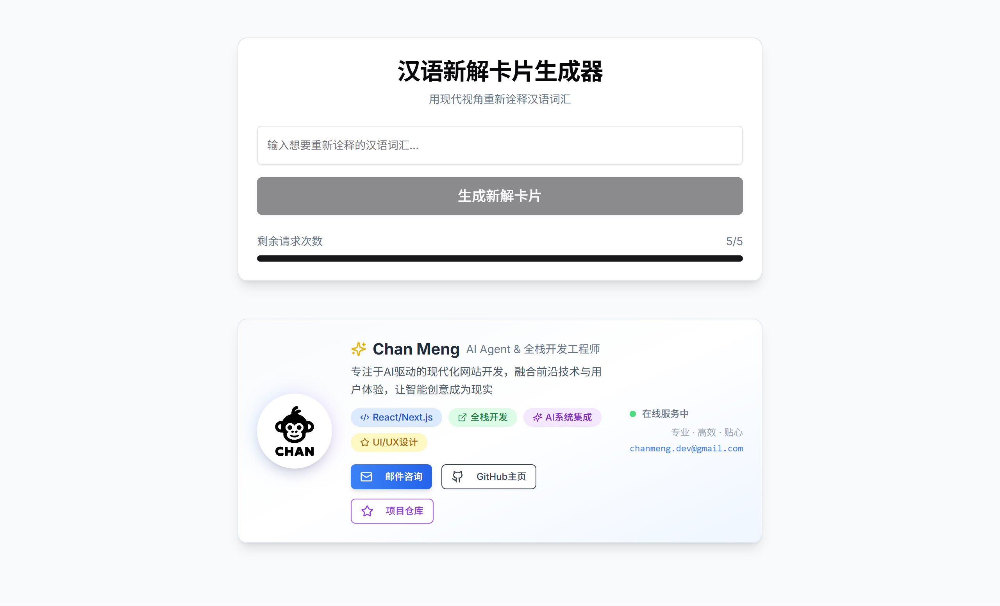

<div align="center"><a name="readme-top"></a>

[](#)

# 🚀 Chinese Redefine<br/><h3>汉语新解 - Modern Chinese Word Redefinition</h3>

An innovative AI-powered tool that reinterprets traditional Chinese words through contemporary perspectives.<br/>
Supports intelligent interpretation generation, beautiful SVG card exports, and responsive design with smooth animations.<br/>
One-click **FREE** deployment of your Chinese word redefinition platform.

[Live Demo][demo-link] · [Documentation][docs] · [GitHub Issues][github-issues-link]

<br/>

[][demo-link]

<br/>

<!-- SHIELD GROUP -->

[![][github-release-shield]][github-release-link]
[![][vercel-shield]][vercel-link]
[![][license-shield]][license-link]<br/>
[![][next-shield]][next-link]
[![][react-shield]][react-link]
[![][typescript-shield]][typescript-link]
[![][tailwind-shield]][tailwind-link]<br/>
[![][github-contributors-shield]][github-contributors-link]
[![][github-forks-shield]][github-forks-link]
[![][github-stars-shield]][github-stars-link]
[![][github-issues-shield]][github-issues-link]<br>

**Share Chinese Redefine**

[![][share-x-shield]][share-x-link]
[![][share-telegram-shield]][share-telegram-link]
[![][share-whatsapp-shield]][share-whatsapp-link]
[![][share-reddit-shield]][share-reddit-link]
[![][share-linkedin-shield]][share-linkedin-link]

<sup>🌟 Redefining Chinese language interpretation for the modern era. Built for language enthusiasts and cultural explorers.</sup>

</div>

> [!IMPORTANT]
> This project demonstrates modern AI integration with Chinese language processing. It combines Google Gemini AI with Next.js to provide intelligent word interpretation with contemporary perspectives. Features include rate limiting, SVG export, and beautiful animations.

<details>
<summary><kbd>📑 Table of Contents</kbd></summary>

#### TOC

- [🚀 Chinese Redefine汉语新解 - Modern Chinese Word Redefinition](#-chinese-redefine汉语新解---modern-chinese-word-redefinition)
      - [TOC](#toc)
      - [](#)
  - [🌟 Introduction](#-introduction)
  - [✨ Key Features](#-key-features)
    - [`1` AI-Powered Interpretation](#1-ai-powered-interpretation)
    - [`2` Beautiful SVG Export](#2-beautiful-svg-export)
    - [`*` Additional Features](#-additional-features)
  - [🛠️ Tech Stack](#️-tech-stack)
  - [🏗️ Architecture](#️-architecture)
    - [System Architecture](#system-architecture)
    - [Component Structure](#component-structure)
  - [⚡️ Performance](#️-performance)
  - [🚀 Getting Started](#-getting-started)
    - [Prerequisites](#prerequisites)
    - [Quick Installation](#quick-installation)
    - [Environment Setup](#environment-setup)
    - [Development Mode](#development-mode)
  - [🛳 Deployment](#-deployment)
    - [`A` Vercel Deployment](#a-vercel-deployment)
    - [`B` Docker Deployment](#b-docker-deployment)
    - [`C` Environment Variables](#c-environment-variables)
  - [📖 Usage Guide](#-usage-guide)
    - [Basic Usage](#basic-usage)
    - [API Reference](#api-reference)
  - [🔌 Integrations](#-integrations)
  - [⌨️ Development](#️-development)
    - [Local Development](#local-development)
    - [Adding Features](#adding-features)
    - [Testing](#testing)
  - [🤝 Contributing](#-contributing)
  - [❤️ Sponsor](#️-sponsor)
  - [📄 License](#-license)
  - [👥 Author](#-author)

####

<br/>

</details>

## 🌟 Introduction

We are passionate about bridging traditional Chinese language with modern perspectives. By leveraging cutting-edge AI technology and contemporary interpretation methods, we aim to provide users with fresh insights into classical Chinese vocabulary.

Whether you're a language learner, cultural researcher, or simply curious about modern interpretations of traditional words, Chinese Redefine will be your digital companion for exploring language evolution. The project is actively maintained and welcomes feedback for any [issues][github-issues-link] encountered.

> [!NOTE]
> - Node.js >= 18.0 required
> - Google Gemini API key required for AI functionality
> - Modern browser with JavaScript enabled
> - Internet connection for AI processing

| [![][demo-badge]][demo-link] | No installation required! Visit our demo to experience AI-powered Chinese word redefinition. |
| :------------------------------------ | :--------------------------------------------------------------------------------------------- |

## 📸 Screenshots

<div align="center">

**Main Interface**


**Word Interpretation Result**


</div>

> [!TIP]
> **⭐ Star us** to receive all release notifications from GitHub without delay!

[![][image-star]][github-stars-link]

## ✨ Key Features

### `1` AI-Powered Interpretation

Experience next-generation Chinese word interpretation powered by Google Gemini AI. Our innovative approach provides contemporary perspectives on traditional vocabulary through advanced natural language processing. This breakthrough feature delivers creative, insightful, and thought-provoking redefinitions.

Key capabilities include:
- 🤖 **Advanced AI**: Google Gemini-powered interpretations
- 🎯 **Cultural Context**: Modern perspective on traditional words
- 🧠 **Creative Insights**: Unique and thought-provoking explanations
- 🛡️ **Content Safety**: Built-in validation and filtering

### `2` Beautiful SVG Export

Revolutionary card generation system that transforms AI interpretations into stunning visual cards. With our advanced SVG generator and intuitive design, users can create shareable content while maintaining professional quality.

**Export Features:**
- **High Quality**: Vector-based SVG format for crisp visuals
- **Customizable**: Responsive design with multiple size options
- **Professional**: Beautiful typography and layout design
- **Instant Download**: One-click export functionality

### `*` Additional Features

Beyond the core features, Chinese Redefine includes:

- [x] 💨 **Instant Processing**: Real-time AI interpretation generation
- [x] 🌐 **Responsive Design**: Perfect experience on all devices
- [x] 🔒 **Rate Limiting**: Built-in API protection (5 requests/minute)
- [x] 💎 **Modern UI**: Beautiful interface with Tailwind CSS and shadcn/ui
- [x] 🎬 **Smooth Animations**: Delightful Framer Motion transitions
- [x] 📱 **Mobile Optimized**: Touch-friendly interface for mobile users
- [x] ⚡ **Performance**: Optimized with Next.js 15 and React 18
- [x] 🎨 **SVG Preview**: Real-time card preview before download

> ✨ More features are continuously being added as the project evolves.

<div align="right">

[![][back-to-top]](#readme-top)

</div>

## 🛠️ Tech Stack

<div align="center">
  <table>
    <tr>
      <td align="center" width="96">
        
        <br>Next.js 15
      </td>
      <td align="center" width="96">
        
        <br>React 18
      </td>
      <td align="center" width="96">
        
        <br>TypeScript 5
      </td>
      <td align="center" width="96">
        
        <br>Tailwind CSS
      </td>
      <td align="center" width="96">
        
        <br>Framer Motion
      </td>
      <td align="center" width="96">
        
        <br>Gemini AI
      </td>
      <td align="center" width="96">
        
        <br>Vercel
      </td>
    </tr>
  </table>
</div>

**Frontend Stack:**
- **Framework**: Next.js 15 with App Router
- **Language**: TypeScript for type safety
- **Styling**: Tailwind CSS + shadcn/ui components
- **Animations**: Framer Motion for smooth transitions
- **Icons**: Lucide React icon library

**AI Integration:**
- **AI Provider**: Google Gemini API
- **Processing**: Real-time Chinese text interpretation
- **Rate Limiting**: Built-in request throttling
- **Validation**: Chinese character validation and filtering

**Development & Deployment:**
- **Development**: ESLint + Prettier for code quality
- **Deployment**: Vercel for seamless hosting
- **Performance**: Optimized bundle splitting
- **Mobile**: Responsive design with PWA capabilities

> [!TIP]
> Each technology was carefully selected for Chinese language processing, AI integration capabilities, and optimal user experience.

## 🏗️ Architecture

### System Architecture


### Component Structure

```
src/
├── app/                    # Next.js App Router
│   ├── api/generate/      # AI generation endpoint
│   ├── globals.css        # Global styles
│   ├── layout.tsx         # Root layout
│   └── page.tsx           # Main application
├── components/            # React components
│   ├── ui/               # shadcn/ui base components
│   ├── CardGenerator.tsx # Main generator component
│   ├── ResultCard.tsx    # Result display
│   ├── DownloadButton.tsx# SVG export functionality
│   └── SVGPreview.tsx    # Card preview
├── lib/                  # Utility libraries
│   ├── animations.ts     # Framer Motion variants
│   ├── errors.ts         # Error handling
│   ├── svgGenerator.ts   # SVG creation logic
│   └── utils.ts          # Helper functions
└── public/               # Static assets
```

## ⚡️ Performance

**Key Metrics:**
- ⚡ **< 1s** Page load time with Next.js optimization
- 🚀 **95+** Lighthouse performance score
- 💨 **< 2s** AI response time via Gemini API
- 📊 **99.9%** uptime on Vercel infrastructure
- 🔄 **Real-time** user interface updates

**Performance Optimizations:**
- 🎯 **Smart Bundling**: Automatic code splitting with Next.js
- 📦 **Component Optimization**: Lazy loading and tree shaking
- 🖼️ **Asset Optimization**: Optimized SVG generation
- 🔄 **API Efficiency**: Rate limiting and request optimization

## 🚀 Getting Started

### Prerequisites

> [!IMPORTANT]
> Ensure you have the following installed:

- Node.js 18.0+ ([Download](https://nodejs.org/))
- npm/yarn/pnpm package manager
- Google Gemini API key ([Get API Key](https://ai.google.dev/))
- Git ([Download](https://git-scm.com/))

### Quick Installation

**1. Clone Repository**

```bash
git clone https://github.com/ChanMeng666/chinese-redefine.git
cd chinese-redefine
```

**2. Install Dependencies**

```bash
# Using npm
npm install

# Using yarn
yarn install

# Using pnpm (recommended)
pnpm install
```

**3. Environment Setup**

```bash
# Create environment file
cp .env.example .env.local

# Edit environment variables
nano .env.local
```

**4. Start Development**

```bash
npm run dev
```

🎉 **Success!** Open [http://localhost:3000](http://localhost:3000) to view the application.

### Environment Setup

Create `.env.local` file with the following variables:

```bash
# Google Gemini API
GEMINI_API_KEY="your-gemini-api-key-here"

# Optional: Analytics & Monitoring
NEXT_PUBLIC_ANALYTICS_ID="your-analytics-id"
```

> [!TIP]
> Get your Gemini API key from [Google AI Studio](https://ai.google.dev/) - it's free to start!

### Development Mode

```bash
# Start with hot reload
npm run dev

# Build for production
npm run build

# Start production server
npm run start

# Run linting
npm run lint
```

## 🛳 Deployment

### `A` Vercel Deployment

**One-Click Deploy:**

[](https://vercel.com/new/clone?repository-url=https%3A%2F%2Fgithub.com%2FChanMeng666%2Fchinese-redefine)

**Manual Deployment:**

```bash
# Install Vercel CLI
npm i -g vercel

# Deploy
vercel --prod
```

### `B` Docker Deployment

```bash
# Build Docker image
docker build -t chinese-redefine .

# Run container
docker run -p 3000:3000 -e GEMINI_API_KEY=your-key chinese-redefine
```

### `C` Environment Variables

| Variable | Description | Required | Example |
|----------|-------------|----------|---------|
| `GEMINI_API_KEY` | Google Gemini API key | ✅ | `AIzaSyC...` |
| `NODE_ENV` | Environment mode | 🔶 | `production` |

> [!NOTE]
> ✅ Required, 🔶 Optional

## 📖 Usage Guide

### Basic Usage

**Getting Started:**

1. **Visit the Application** at [chinese-redefine.vercel.app](https://chinese-redefine.vercel.app)
2. **Enter Chinese Word** in the input field (up to 10 characters)
3. **Click Generate** to get AI-powered interpretation
4. **Preview & Download** your custom SVG card

**Input Requirements:**
- Must contain Chinese characters (汉字)
- Maximum 10 characters
- No special symbols or HTML tags
- Rate limit: 5 requests per minute

### API Reference

**Generate Interpretation:**

```bash
POST /api/generate
Content-Type: application/json

{
  "word": "智慧"
}

# Response
{
  "result": "现代社会中，智慧不再是知识的积累，而是在信息爆炸时代中保持清醒头脑，懂得什么时候说'我不知道'的勇气。",
  "remaining": 4
}
```

**Rate Limiting:**
- 🔄 **5 requests/minute** per IP address
- 📊 Rate limit headers included in responses
- ⏰ **60-second** reset window

## 🔌 Integrations

| Service | Purpose | Status | Documentation |
|---------|---------|--------|---------------|
| **Google Gemini** | AI text generation | ✅ Active | [Gemini API](https://ai.google.dev/) |
| **Vercel** | Hosting & deployment | ✅ Active | [Vercel Docs](https://vercel.com/docs) |
| **Framer Motion** | Animations | ✅ Active | [Motion Docs](https://www.framer.com/motion/) |
| **Tailwind CSS** | Styling framework | ✅ Active | [Tailwind Docs](https://tailwindcss.com/) |

## ⌨️ Development

### Local Development

**Setup Development Environment:**

```bash
# Clone repository
git clone https://github.com/ChanMeng666/chinese-redefine.git
cd chinese-redefine

# Install dependencies
pnpm install

# Set up environment
cp .env.example .env.local

# Start development server
pnpm dev
```

**Development Scripts:**

```bash
# Development
pnpm dev          # Start dev server with hot reload
pnpm build        # Production build
pnpm start        # Start production server
pnpm lint         # ESLint code checking
```

### Adding Features

**Feature Development Workflow:**

1. **Create Feature Branch:**
```bash
git checkout -b feature/amazing-feature
```

2. **Development Guidelines:**
- ✅ Follow TypeScript best practices
- ✅ Add proper error handling
- ✅ Include responsive design
- ✅ Test with Chinese characters
- ✅ Follow accessibility guidelines

3. **Component Structure:**
```typescript
// components/NewFeature.tsx
'use client';

import React from 'react';
import { motion } from 'framer-motion';

const NewFeature = () => {
  return (
    <motion.div
      initial={{ opacity: 0 }}
      animate={{ opacity: 1 }}
    >
      {/* Your feature content */}
    </motion.div>
  );
};

export default NewFeature;
```

### Testing

**Manual Testing:**
- ✅ Test with various Chinese words
- ✅ Verify rate limiting functionality
- ✅ Check SVG export quality
- ✅ Test responsive design on mobile
- ✅ Validate error handling

## 🤝 Contributing

We welcome contributions! Here's how you can help improve Chinese Redefine:

**Contributing Process:**

1. **Fork & Clone:**
```bash
git clone https://github.com/your-username/chinese-redefine.git
cd chinese-redefine
```

2. **Create Branch:**
```bash
git checkout -b feature/your-feature-name
```

3. **Make Changes:**
- Follow our [coding standards](#development)
- Test your changes thoroughly
- Update documentation as needed

4. **Submit PR:**
- Provide clear description
- Include screenshots for UI changes
- Reference related issues

**Contribution Areas:**
- 🐛 **Bug Reports**: Help us identify and fix issues
- 💡 **Feature Requests**: Suggest new functionality
- 📚 **Documentation**: Improve our guides and examples
- 🌐 **Localization**: Add support for more languages

<a href="https://github.com/ChanMeng666/chinese-redefine/graphs/contributors" target="_blank">
  
</a>

## ❤️ Sponsor

Support Chinese Redefine development and help us continue building amazing tools for language exploration!

**Sponsor Benefits:**
- 🎯 **Priority Support**: Get help faster
- 🚀 **Early Access**: Try new features first
- 💬 **Direct Communication**: Connect with maintainers
- 🏷️ **Recognition**: Credits in documentation

## 📄 License

This project is licensed under the MIT License - see the [LICENSE](LICENSE) file for details.

**Open Source Benefits:**
- ✅ Commercial use allowed
- ✅ Modification allowed
- ✅ Distribution allowed
- ✅ Private use allowed

## 👥 Author

<div align="center">
  <table>
    <tr>
      <td align="center">
        <a href="https://github.com/ChanMeng666">
          
          <br />
          <sub><b>Chan Meng</b></sub>
        </a>
        <br />
        <small>Creator & Lead Developer</small>
      </td>
    </tr>
  </table>
</div>

**Chan Meng**
-  LinkedIn: [chanmeng666](https://www.linkedin.com/in/chanmeng666/)
-  GitHub: [ChanMeng666](https://github.com/ChanMeng666)
-  Email: [chanmeng.dev@gmail.com](mailto:chanmeng.dev@gmail.com)
-  Website: [chanmeng.live](https://2d-portfolio-eta.vercel.app/)

---

<div align="center">
<strong>🚀 Redefining Chinese Language Interpretation 🌟</strong>
<br/>
<em>Bridging traditional wisdom with modern perspectives</em>
<br/><br/>

⭐ **Star us on GitHub** • 📖 **Read the Documentation** • 🐛 **Report Issues** • 💡 **Request Features** • 🤝 **Contribute**

<br/><br/>

**Made with ❤️ by Chan Meng**


</div>

---

<!-- LINK DEFINITIONS -->

[back-to-top]: https://img.shields.io/badge/-BACK_TO_TOP-151515?style=flat-square

<!-- Project Links -->
[demo-link]: https://chinese-redefine.vercel.app
[docs]: https://github.com/ChanMeng666/chinese-redefine#readme
[github-issues-link]: https://github.com/ChanMeng666/chinese-redefine/issues
[github-stars-link]: https://github.com/ChanMeng666/chinese-redefine/stargazers
[github-forks-link]: https://github.com/ChanMeng666/chinese-redefine/forks
[github-contributors-link]: https://github.com/ChanMeng666/chinese-redefine/contributors
[github-release-link]: https://github.com/ChanMeng666/chinese-redefine/releases
[license-link]: https://github.com/ChanMeng666/chinese-redefine/blob/main/LICENSE

<!-- Technology Links -->
[next-link]: https://nextjs.org
[react-link]: https://reactjs.org
[typescript-link]: https://www.typescriptlang.org
[tailwind-link]: https://tailwindcss.com
[vercel-link]: https://vercel.com

<!-- Shield Badges -->
[github-release-shield]: https://img.shields.io/github/v/release/ChanMeng666/chinese-redefine?color=369eff&labelColor=black&logo=github&style=flat-square
[vercel-shield]: https://img.shields.io/badge/vercel-online-55b467?labelColor=black&logo=vercel&style=flat-square
[license-shield]: https://img.shields.io/badge/license-MIT-white?labelColor=black&style=flat-square
[next-shield]: https://img.shields.io/badge/Next.js-15-black?labelColor=black&logo=next.js&style=flat-square
[react-shield]: https://img.shields.io/badge/React-18-blue?labelColor=black&logo=react&style=flat-square
[typescript-shield]: https://img.shields.io/badge/TypeScript-5-blue?labelColor=black&logo=typescript&style=flat-square
[tailwind-shield]: https://img.shields.io/badge/Tailwind-3.4-blue?labelColor=black&logo=tailwindcss&style=flat-square
[github-contributors-shield]: https://img.shields.io/github/contributors/ChanMeng666/chinese-redefine?color=c4f042&labelColor=black&style=flat-square
[github-forks-shield]: https://img.shields.io/github/forks/ChanMeng666/chinese-redefine?color=8ae8ff&labelColor=black&style=flat-square
[github-stars-shield]: https://img.shields.io/github/stars/ChanMeng666/chinese-redefine?color=ffcb47&labelColor=black&style=flat-square
[github-issues-shield]: https://img.shields.io/github/issues/ChanMeng666/chinese-redefine?color=ff80eb&labelColor=black&style=flat-square

<!-- Badge Variants -->
[demo-badge]: https://img.shields.io/badge/TRY%20DEMO-ONLINE-55b467?labelColor=black&logo=vercel&style=for-the-badge

<!-- Social Share Links -->
[share-x-link]: https://x.com/intent/tweet?hashtags=AI,Chinese,OpenSource&text=Check%20out%20Chinese%20Redefine%20-%20AI-powered%20Chinese%20word%20interpretation&url=https%3A%2F%2Fgithub.com%2FChanMeng666%2Fchinese-redefine
[share-telegram-link]: https://t.me/share/url?text=Check%20out%20Chinese%20Redefine&url=https%3A%2F%2Fgithub.com%2FChanMeng666%2Fchinese-redefine
[share-whatsapp-link]: https://api.whatsapp.com/send?text=Check%20out%20Chinese%20Redefine%20https%3A%2F%2Fgithub.com%2FChanMeng666%2Fchinese-redefine
[share-reddit-link]: https://www.reddit.com/submit?title=Chinese%20Redefine%20-%20AI%20Chinese%20Word%20Interpretation&url=https%3A%2F%2Fgithub.com%2FChanMeng666%2Fchinese-redefine
[share-linkedin-link]: https://linkedin.com/sharing/share-offsite/?url=https://github.com/ChanMeng666/chinese-redefine

[share-x-shield]: https://img.shields.io/badge/-share%20on%20x-black?labelColor=black&logo=x&logoColor=white&style=flat-square
[share-telegram-shield]: https://img.shields.io/badge/-share%20on%20telegram-black?labelColor=black&logo=telegram&logoColor=white&style=flat-square
[share-whatsapp-shield]: https://img.shields.io/badge/-share%20on%20whatsapp-black?labelColor=black&logo=whatsapp&logoColor=white&style=flat-square
[share-reddit-shield]: https://img.shields.io/badge/-share%20on%20reddit-black?labelColor=black&logo=reddit&logoColor=white&style=flat-square
[share-linkedin-shield]: https://img.shields.io/badge/-share%20on%20linkedin-black?labelColor=black&logo=linkedin&logoColor=white&style=flat-square

<!-- Images -->
[image-star]: https://via.placeholder.com/800x200/FFD700/000000?text=Star+Us+on+GitHub
